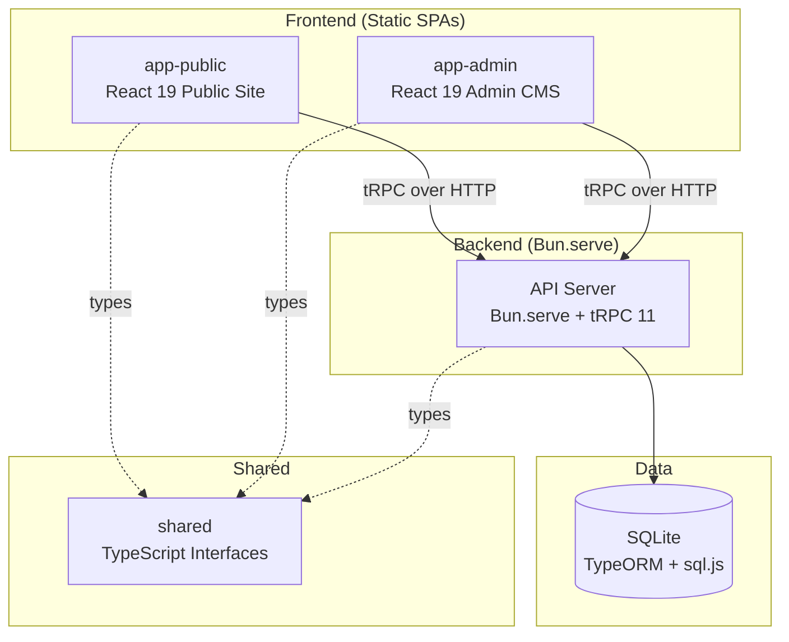

# Contributing to satyrsmc

## Architecture Overview



**Packages:**

| Package | Purpose |
|---|---|
| `@satyrsmc/api` | Bun HTTP server, tRPC 11 routers, TypeORM entities, services, SQLite database |
| `@satyrsmc/app-admin` | React 19 admin panel for club management (members, contacts, events, budgets, meetings, website CMS) |
| `@satyrsmc/app-public` | React 19 public website (home, about, events, gallery, members) |
| `@satyrsmc/shared` | Hand-written TypeScript interfaces shared across all packages |

## Prerequisites

- [Bun](https://bun.sh) v1.x
- [Docker](https://docker.com) (optional — for running the API as a container)

## Local Development

**Dev server** (builds frontends, starts API with HMR):

```bash
bun run dev
```

**API only** (no frontend serving):

```bash
bun run start:api-only
```

**Docker** (API container with data volume):

```bash
make docker-api       # Build image
make docker-api-run   # Run on :3000 with ./data volume
```

**Storybook** (component development):

```bash
bun run storybook     # Dev server on :6006
```

## Key Commands

```bash
# Root (from repo root)
bun run dev              # Build frontends + start API dev server
bun run build            # Build both SPAs (app-public + app-admin)
bun run start            # Start API server (production mode)
bun run start:api-only   # Start API without serving static files
bun run test             # Run API tests
bun run migrate          # Run TypeORM migrations
bun run storybook        # Storybook dev server

# Static site build + deploy
make build-static        # Build unified static site into dist/
make deploy-static       # Sync dist/ to S3
make deploy-static-dry   # Dry-run deploy
```

## Running Tests

```bash
bun test                            # All API tests
bun test packages/api/src/          # API tests (explicit path)
```

## Project Structure

```
satyrsmc/
  packages/
    api/                    # Backend: Bun.serve + tRPC + TypeORM
      src/
        index.ts            # Bun.serve() entry point (:3000)
        api-only.ts         # API-only entry (no static serving)
        server.ts           # Route handler (tRPC, health, photos, SPA fallback)
        db/
          dataSource.ts     # TypeORM DataSource config (sqljs driver)
          dbAdapter.ts      # DbLike interface for raw SQL
          migrations/       # TypeORM MigrationInterface classes
        entities/           # TypeORM @Entity classes (~50 entities)
        services/           # Service classes (one per domain)
        trpc/
          root.ts           # appRouter = { website, admin }
          routers/
            website.ts      # Public website router
            admin/          # Admin routers (15+ resource routers)
      scripts/
        migrate.ts          # Migration runner CLI
      Dockerfile            # Docker image for API
    app-admin/              # Admin SPA: React 19 + TanStack Query + tRPC
      src/
        App.tsx             # Routes + layout
        entry.tsx           # Bootstrap (BrowserRouter, tRPC, ReactQuery)
        trpc.ts             # createTRPCReact<AppRouter>()
        data/api/           # ApiClient classes per resource
        queries/            # React Query hooks
      build.ts              # Bun.build() script
    app-public/             # Public website SPA: React 19
      src/
        App.tsx             # Routes
        trpc.ts             # createTRPCReact<AppRouter>()
        content/            # Static content (events)
        data/               # Static data (members.json)
      build.ts              # Bun.build() script
    shared/                 # Shared TypeScript interfaces
      types/                # Per-domain type definitions
      lib/                  # Constants and utilities
  data/                     # Runtime data directory
    badger.db               # SQLite database file
  .storybook/               # Storybook config
  Makefile                  # Build and deploy targets
```

## Database

### Current: SQLite via sql.js

The database is a SQLite file at `data/badger.db`, accessed via TypeORM's `sqljs` driver. This keeps the application fully self-contained with no external database server.

> **Planned:** Migration to Neon Postgres is planned for future scalability. The TypeORM entity layer should make this transition straightforward — change the driver config, adjust column types where needed.

### TypeORM Migration Workflow

All schema changes use TypeORM migrations. Never modify the database manually.

```bash
# 1. Create a new migration class
#    packages/api/src/db/migrations/<timestamp>-<Name>.ts

# 2. Implement MigrationInterface
```

```typescript
import type { MigrationInterface, QueryRunner } from "typeorm";

export class AddNewFeature1740000021000 implements MigrationInterface {
  name = "AddNewFeature1740000021000";

  async up(queryRunner: QueryRunner): Promise<void> {
    await queryRunner.query(`
      CREATE TABLE IF NOT EXISTS new_table (
        id TEXT PRIMARY KEY,
        name TEXT NOT NULL,
        created_at TEXT DEFAULT (datetime('now'))
      )
    `);
  }

  async down(queryRunner: QueryRunner): Promise<void> {
    await queryRunner.query("DROP TABLE IF EXISTS new_table");
  }
}
```

```bash
# 3. Register in dataSource.ts (add import + add to migrations array)

# 4. Run migrations
bun run migrate

# 5. If you added a new table, create a matching:
#    - Entity class in packages/api/src/entities/
#    - Shared type in packages/shared/types/
#    - Service in packages/api/src/services/
#    - Register entity in dataSource.ts entities array
```

Migrations run automatically on server startup (`migrationsRun: true`).

## CI/CD

> **TODO:** CI/CD pipelines are not yet configured. When set up, they should include:
> - Lint, typecheck, and test jobs per package
> - Coverage enforcement
> - Deploy previews for PRs
> - Production deploy on merge to `main`

## Environment Variables

| Variable | Description |
|---|---|
| `DATA_DIR` | Override data directory path (default: repo root) |
| `PORT` | API server port (default: 3000) |
| `NODE_ENV` | `production` for production mode |

Bun automatically loads `.env` files — do not use `dotenv`.

---

# Development Conventions

## Bun-First

This project uses Bun exclusively. Do not introduce Node.js, npm, Vite, or other runtimes.

- `bun run <script>` — not `npm run`
- `bun test` — not jest or vitest
- `Bun.build()` — not webpack, esbuild, or Vite
- `Bun.serve()` — not Express
- `bun:sqlite` — not better-sqlite3 (for any new SQLite needs)
- Bun auto-loads `.env` — do not use dotenv

## TypeScript Configuration

Always maintain:
- `strict: true`
- `noUncheckedIndexedAccess: true` — forces null-checking on array/object access
- `verbatimModuleSyntax: true` — enforces `import type` for type-only imports
- `experimentalDecorators: true` + `emitDecoratorMetadata: true` — required for TypeORM

Use `.charAt(0)` instead of `[0]` for string access (required by `noUncheckedIndexedAccess`):
```typescript
// GOOD
const first = str.charAt(0);

// BAD (may be undefined with noUncheckedIndexedAccess)
const first = str[0];
```

## End-to-End Type Safety

Types must flow from the database through to the frontend without manual duplication or unsafe casts. The chain:

```
TypeORM Entity → Service (returns shared type) → tRPC Router → AppRouter type → createTRPCReact<AppRouter>() → Frontend hooks
```

### Rules

1. **Shared types are the cross-package contract.** Define interfaces in `@satyrsmc/shared/types/*`. Services annotate return types with these interfaces. tRPC infers them automatically. Frontends consume them via `createTRPCReact<AppRouter>()`.

2. **Service return types MUST be annotated** with the shared interface:
   ```typescript
   // GOOD — explicit return type using shared interface
   function entityToContact(e: ContactEntity): Contact {
     return { id: e.id, display_name: e.displayName, ... };
   }

   // BAD — anonymous inferred type can silently drift
   function entityToContact(e: ContactEntity) {
     return { id: e.id, display_name: e.displayName, ... };
   }
   ```

3. **Never bypass tRPC's inferred types.** Do not use `as never`, `as any`, or `as Record<string, unknown>` to force data through tRPC calls. If types don't align, fix the source.

4. **Zod schemas for tRPC inputs.** All mutation inputs must have proper Zod validation. Do not use `.passthrough()` to accept arbitrary fields.

5. **Import from canonical paths:**
   ```typescript
   // GOOD
   import type { Contact } from "@satyrsmc/shared/types/contact";

   // BAD — fragile barrel re-export from unrelated module
   import type { Contact } from "@satyrsmc/shared/types/budget";
   ```

6. **Frontend hooks use tRPC-inferred types.** Do not manually re-annotate or cast return types from `useSuspenseQuery()`.

### Adding a New Domain Type

1. **Define the shared interface** in `packages/shared/types/<domain>.ts`
2. **Add the export** to `packages/shared/package.json` exports map
3. **Create the TypeORM entity** in `packages/api/src/entities/` — register in `dataSource.ts`
4. **Create the service** in `packages/api/src/services/` — import and return the shared type explicitly
5. **Create the tRPC router** — Zod schemas for inputs, delegate to service
6. **Frontend consumes** via `trpc.<namespace>.<procedure>.useSuspenseQuery()` — types flow automatically

## Database & Schema

### TypeORM Entities

Entities are the source of truth for database schema. Use TypeORM decorators:

```typescript
import { Entity, PrimaryColumn, Column } from "typeorm";

@Entity("table_name")
export class MyEntity {
  @PrimaryColumn("text")
  id!: string;

  @Column({ name: "display_name", type: "text" })
  displayName!: string;

  @Column({ type: "text", nullable: true })
  notes!: string | null;

  @Column({ name: "created_at", type: "text", nullable: true })
  createdAt!: string | null;
}
```

### ID Strategy

Use CUID2 (`@paralleldrive/cuid2` or the `uuid()` utility in services) for all IDs. Store as `TEXT` columns. Generate IDs in application code, never at the database level.

### Field Selection

Services should use explicit field selection where performance matters. Avoid `SELECT *` in raw queries — specify the columns you need.

## tRPC Routers (Thin Router Pattern)

tRPC routers contain ONLY:
1. Zod input validation
2. Delegation to `ctx.api.*` service methods

**Never put business logic or database access in routers.** All data operations go through services.

```typescript
// GOOD
list: t.procedure
  .input(searchParams.optional())
  .query(({ ctx, input }) => ctx.api.contacts.list(input ?? {})),

// BAD — business logic in router
list: t.procedure.query(async ({ ctx }) => {
  const repo = ctx.ds.getRepository(Contact);
  const contacts = await repo.find({ where: { deletedAt: IsNull() } });
  return contacts.map(c => ({ ...c, fullName: `${c.firstName} ${c.lastName}` }));
}),
```

## Service Pattern

Services encapsulate all database access for a domain. They:
- Take `DbLike` and `DataSource` in constructor
- Return shared types (explicitly annotated)
- Contain business logic and data transformation
- Use factory pattern for dependency injection

See `packages/api/src/services/ContactsService.ts` as the gold-standard example.

## React Patterns (React 19)

### Context API
- Use `use()` hook, NOT `useContext()`
- Render `<Context value={...}>`, NOT `<Context.Provider>`
- Pass `ref` as prop, NOT via `forwardRef`

### Router
Import from `react-router` or `react-router-dom`:
```typescript
import { Link, useNavigate } from "react-router-dom";
```

## Styling & UI

### Tailwind CSS 4
- No `postcss.config.js` or `tailwind.config.js`
- Use `bun-plugin-tailwind` for builds
- Theme tokens in `@theme` blocks in CSS
- Custom utilities via `@utility` blocks

### shadcn/ui Components
Install as local source files (NOT as a package). Components use React 19 patterns (ref as prop, no forwardRef).

## Security

### HTML Rendering
**Never use `dangerouslySetInnerHTML` directly.** Always use the `SafeHtml` component that wraps DOMPurify.

### No Suppressions
Never use:
- `eslint-disable`
- `@ts-ignore`
- `@ts-expect-error`

Fix root causes instead of suppressing warnings.

### No `any`
`@typescript-eslint/no-explicit-any` should be treated as an error. Use proper types or `unknown` with narrowing.

## Testing

### Coverage Requirements
Target **90% coverage thresholds** for statements, branches, functions, and lines.

### Two-Layer Strategy
1. **Unit tests**: Mock services, test business logic
2. **Integration tests**: Use real SQLite database for data operations

### Test Data
Use typed interfaces for fixture data. Import shared types to ensure test data matches the contract.

## Error Handling

### Generic Responses for Security
When an operation could reveal information (user enumeration, email existence), always return generic responses:
```typescript
// GOOD
return { message: "If that email exists, a reset link has been sent" };

// BAD (reveals if email exists)
if (!user) throw new Error("Email not found");
```

### Loading States
Every data-fetching component must handle:
1. Loading state (Skeleton components)
2. Error state (Alert/error message)
3. Empty state (if applicable)
4. Success state (data display)

## Password & Auth

### Password Requirements
- 8-128 characters
- At least one uppercase, lowercase, number, and special character
- Enforce via Zod schema with separate regex checks

### Cookie Configuration
- `httpOnly: true` (always)
- `secure: true` in production
- `sameSite: "strict"` in production, `"lax"` in development
- Separate cookies for access (short-lived) and refresh (long-lived) tokens

### Token Storage
Store SHA-256 hashes of tokens in database. Send raw tokens in emails/links. Never store raw tokens.

## Code Style

- `console.info` for server startup and informational messages (not `console.log`)
- Type-only imports: `import type { Foo } from "./types"`
- Mixed imports: `import { type Foo, getUser } from "./api"`
- Lazy singletons for external services (avoid env var errors in test environments)

## Linting & Formatting

> **TODO:** ESLint flat config and Prettier are not yet configured in this repo. When set up:
> - Use ESLint flat config with `@eslint-react/eslint-plugin`
> - Prettier: double quotes, semicolons, trailing commas
> - Pre-commit hook: lint-staged (ESLint + Prettier)
> - Pre-push hook: coverage enforcement
