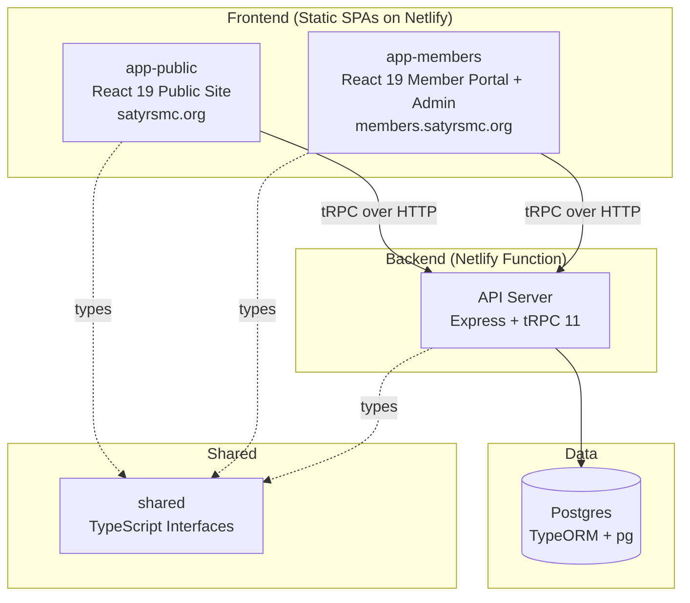

# Contributing to satyrsmc

## Architecture Overview


```mermaid
graph TB
    subgraph "Frontend (Static SPAs on Netlify)"
        PUB[app-public<br/>React 19 Public Site<br/>satyrsmc.org]
        ADM[app-members<br/>React 19 Member Portal + Admin<br/>members.satyrsmc.org]
    end

    subgraph "Backend (Netlify Function)"
        API[API Server<br/>Express + tRPC 11]
    end

    subgraph "Data"
        DB[(Postgres<br/>TypeORM + pg)]
    end

    subgraph "Shared"
        SH[shared<br/>TypeScript Interfaces]
    end

    PUB -->|tRPC over HTTP| API
    ADM -->|tRPC over HTTP| API
    API --> DB
    PUB -.->|types| SH
    ADM -.->|types| SH
    API -.->|types| SH
```

**Packages:**

| Package                 | Purpose                                                                                                |
| ----------------------- | ------------------------------------------------------------------------------------------------------ |
| `@satyrsmc/api`         | Express + tRPC 11 server, TypeORM entities, services, Postgres database. Deployed as Netlify Function. |
| `@satyrsmc/app-members` | React 19 member portal and admin panel (members, contacts, events, budgets, meetings, website CMS)     |
| `@satyrsmc/app-public`  | React 19 public website (home, about, events, gallery, members)                                        |
| `@satyrsmc/shared`      | Zod DTO schemas and derived TypeScript types shared across all packages                                |

## Prerequisites

- [Node.js](https://nodejs.org) 22 LTS
- [pnpm](https://pnpm.io) 9+
- [Docker](https://docker.com) (for local Postgres — started automatically by `pnpm dev`)

**PGlite** is used automatically for all tests — no setup required.

## Local Development

1. Copy the env template: `cp packages/api/.env.example packages/api/.env`
2. Set `DATABASE_URL` in `packages/api/.env` to your local Postgres instance.
3. Start services (each in its own terminal):

```bash
pnpm --filter @satyrsmc/api dev              # API on http://localhost:4000
pnpm --filter @satyrsmc/app-public dev       # app-public on http://localhost:3000
pnpm --filter @satyrsmc/app-members dev      # app-members on http://localhost:3001
```

Vite dev servers proxy `/trpc` and `/api` requests to the API at `localhost:4000` automatically.

**Storybook** (component development):

```bash
pnpm storybook    # Dev server on :6006
```

## Key Commands

```bash
# Root (from repo root)
pnpm build            # Build both SPAs (app-public + app-members)
pnpm test             # Run tests across all packages
pnpm typecheck        # Type-check all packages
pnpm lint             # Lint all packages
pnpm storybook        # Storybook dev server

# Package-level — dev servers (each in its own terminal)
pnpm --filter @satyrsmc/api dev                # API dev server (port 4000)
pnpm --filter @satyrsmc/app-public dev         # app-public Vite dev server (port 3000)
pnpm --filter @satyrsmc/app-members dev        # app-members Vite dev server (port 3001)

# Package-level — other
pnpm --filter @satyrsmc/api migrate            # Run TypeORM migrations
pnpm --filter @satyrsmc/api seed               # Seed sample users for manual testing
pnpm --filter @satyrsmc/api build:function     # Bundle API as Netlify Function
pnpm --filter @satyrsmc/api test               # Run API tests only
pnpm --filter @satyrsmc/app-public build       # Build app-public
pnpm --filter @satyrsmc/app-members build      # Build app-members
```

## Seed Data

Run `pnpm --filter @satyrsmc/api seed` to create sample user accounts for manual testing. The script is idempotent — it skips users that already exist. Configure `DATABASE_URL` in `packages/api/.env`.

All seed accounts use the password: **`Password1!`**

| Username    | Type      | Status    | Member? | Notes                    |
| ----------- | --------- | --------- | ------- | ------------------------ |
| `admin`     | admin     | active    | yes     | Full admin access        |
| `webmaster` | webmaster | active    | yes     | Webmaster access         |
| `member`    | user      | active    | yes     | Active member user       |
| `user`      | user      | active    | no      | Regular user (no member) |
| `locked`    | user      | locked    | no      | Pending approval         |
| `suspended` | user      | suspended | no      | Suspended account        |

## Running Tests

```bash
pnpm test                                    # All packages
pnpm test:coverage                           # All packages with coverage (Istanbul, 80% threshold)
pnpm --filter @satyrsmc/api test             # API tests only
pnpm --filter @satyrsmc/api test:coverage    # API tests with coverage
pnpm --filter @satyrsmc/app-members test     # app-members tests only
pnpm --filter @satyrsmc/app-public test      # app-public tests only
```

Tests always use PGlite (embedded Postgres) — no local database needed for testing.

## Project Structure

```
satyrsmc/
  packages/
    api/                    # Backend: Express + tRPC + TypeORM
      src/
        index.ts            # Local dev entry — app.listen(:4000)
        server.ts           # Express app factory (createExpressApp)
        netlify-handler.ts  # Netlify Function entry (serverless-http wrapper)
        db/
          dataSource.ts     # TypeORM DataSource config (postgres driver)
          dbAdapter.ts      # DbLike interface for raw SQL
          migrations/       # TypeORM MigrationInterface classes
        entities/           # TypeORM @Entity classes (~50 entities)
        services/           # Service classes (one per domain)
        trpc/
          root.ts           # appRouter = { website, admin, members, auth }
          routers/
            website.ts      # Public website router
            admin/          # Admin routers (15+ resource routers)
            members/        # Member portal routers
      tsup.config.ts        # Production bundle → netlify/functions/api.mjs
      netlify.toml          # Netlify Function routing (/trpc/*, /api/*)
      scripts/
        migrate.ts          # Migration runner CLI
    app-members/            # Member portal + admin SPA: React 19 + TanStack Query + tRPC
      src/
        App.tsx             # Routes + layout
        entry.tsx           # Bootstrap (BrowserRouter, tRPC, ReactQuery)
        trpc.ts             # createTRPCReact<AppRouter>()
        data/api/           # ApiClient classes per resource
        queries/            # React Query hooks
      vite.config.ts        # Vite config (base: "/")
      netlify.toml          # SPA fallback redirect
    app-public/             # Public website SPA: React 19
      src/
        App.tsx             # Routes
        trpc.ts             # createTRPCReact<AppRouter>()
        content/            # Static content (events)
        data/               # Static data (members.json)
      vite.config.ts        # Vite config (base: "/")
      netlify.toml          # SPA fallback redirect
    shared/                 # Zod DTO schemas, derived types, and utilities
      src/
        dto/                # DTO schemas and inferred types (admin/, website/)
        client/             # tRPC client, React providers, re-exports
        lib/                # Constants, enums, and utilities
  .storybook/               # Storybook config
```

## Database

### Current: Postgres via TypeORM

The database is Postgres, accessed via TypeORM's `postgres` driver. In production, the project uses [Neon](https://neon.tech) serverless Postgres. For tests, PGlite provides an embedded Postgres instance (always used — hardcoded in `src/test/setup.ts`). Connection is configured via the `DATABASE_URL` environment variable.

### TypeORM Migration Workflow

All schema changes use TypeORM migrations. Never modify the database manually.

```bash
# 1. Create a new migration class
#    packages/api/src/db/migrations/<timestamp>-<Name>.ts

# 2. Implement MigrationInterface
```

```typescript
import type { MigrationInterface, QueryRunner } from "typeorm";

export class AddNewFeature1740000021000 implements MigrationInterface {
  name = "AddNewFeature1740000021000";

  async up(queryRunner: QueryRunner): Promise<void> {
    await queryRunner.query(`
      CREATE TABLE IF NOT EXISTS new_table (
        id TEXT PRIMARY KEY,
        name TEXT NOT NULL,
        is_active BOOLEAN NOT NULL DEFAULT true,
        created_at TIMESTAMPTZ DEFAULT now()
      )
    `);
  }

  async down(queryRunner: QueryRunner): Promise<void> {
    await queryRunner.query("DROP TABLE IF EXISTS new_table");
  }
}
```

```bash
# 3. Register in dataSource.ts (add import + add to migrations array)

# 4. Run migrations
pnpm --filter @satyrsmc/api migrate

# 5. If you added a new table, create a matching:
#    - Entity class in packages/api/src/entities/
#    - Shared DTO in packages/shared/src/dto/admin/
#    - Service in packages/api/src/services/
#    - Register entity in dataSource.ts entities array
```

Migrations run automatically on server startup (`migrationsRun: true`).

## CI/CD

GitHub Actions runs lint, typecheck, and tests on every pull request (`.github/workflows/test.yml`).

Staging deploys automatically on merge to `main` via `.github/workflows/deploy-staging.yml`. It can also be triggered manually via workflow dispatch with a branch name or SHA. The three staging Netlify sites are **CLI-deploy only** — they are not connected to the git repo in Netlify's dashboard.

- API deploys as a Netlify Function to `https://staging-satyrsmc-api.netlify.app`
- app-public deploys as a static site to `https://staging-satyrsmc-public.netlify.app`
- app-members deploys as a static site to `https://staging-satyrsmc-members.netlify.app`

Production deployments are handled separately (not automated).

## Environment Variables

| Variable       | Location            | Description                                         |
| -------------- | ------------------- | --------------------------------------------------- |
| `DATABASE_URL` | `packages/api/.env` | Postgres connection string (required for local dev) |
| `JWT_SECRET`   | `packages/api/.env` | JWT signing secret (required)                       |
| `PORT`         | `packages/api/.env` | API server port (default: 4000)                     |
| `NODE_ENV`     | set by scripts      | `production` for production mode                    |

Node.js does **not** auto-load `.env` files — `import "dotenv/config"` is added to all server entry points and scripts. See `packages/api/.env.example` for a template.

---

# Development Conventions

## Node.js + pnpm

This project uses Node.js with pnpm workspaces. Do not introduce Bun, Deno, or other runtimes.

- `pnpm <script>` — not `npm run` or `bun run`
- `vitest` — not jest or `bun test`
- `Vite` — for frontend builds (app-public, app-members)
- `tsup` — for API Netlify Function production bundle only
- `tsx` — for running scripts and local API dev server
- `Express` — not `Bun.serve()`
- `import "dotenv/config"` — required in server entry points; Node.js does not auto-load `.env`
- `node:fs` (`existsSync`, `readFileSync`, etc.) — not `Bun.file()`

## pnpm Overrides

The root `package.json` contains a `pnpm.overrides` section to work around stale peer dependency constraints in upstream packages. These overrides should be removed once the relevant packages release updated versions.

| Override                                                    | Reason                                                                                                                                                                                | Remove when                                                                               |
| ----------------------------------------------------------- | ------------------------------------------------------------------------------------------------------------------------------------------------------------------------------------- | ----------------------------------------------------------------------------------------- |
| `@joshwooding/vite-plugin-react-docgen-typescript: "0.7.0"` | `@storybook/react-vite` pins `^0.6.4`, which doesn't declare Vite 8 support. Version 0.7.0 does.                                                                                      | Storybook updates its own peer pin to `^0.7.0` or higher                                  |
| `peerDependencyRules.allowedVersions.typescript: "*"`       | `typescript-eslint@8.57.2` and `@eslint-react/eslint-plugin` declare `typescript: ">=4.8.4 <6.0.0"` but work correctly with TypeScript 6. This suppresses the false-positive warning. | `typescript-eslint` releases a version that declares `typescript: ">=4.8.4"` (or similar) |

## TypeScript Configuration

Always maintain:

- `strict: true`
- `noUncheckedIndexedAccess: true` — forces null-checking on array/object access
- `verbatimModuleSyntax: true` — enforces `import type` for type-only imports
- `experimentalDecorators: true` + `emitDecoratorMetadata: true` — required for TypeORM

Use `.charAt(0)` instead of `[0]` for string access (required by `noUncheckedIndexedAccess`):

```typescript
// GOOD
const first = str.charAt(0);

// BAD (may be undefined with noUncheckedIndexedAccess)
const first = str[0];
```

## End-to-End Type Safety

Types must flow from the database through to the frontend without manual duplication or unsafe casts. The chain:

```
TypeORM Entity → Service (returns shared type) → tRPC Router → AppRouter type → createTRPCReact<AppRouter>() → Frontend hooks
```

### Rules

1. **Shared types are the cross-package contract.** Define DTO schemas in `@satyrsmc/shared/dto/*` and enums in `@satyrsmc/shared/lib/enums`. Services annotate return types with these interfaces. tRPC infers them automatically. Frontends consume them via `createTRPCReact<AppRouter>()`.

2. **Service return types MUST be annotated** with the shared interface:

   ```typescript
   // GOOD — explicit return type using shared interface
   function entityToContact(e: ContactEntity): Contact {
     return { id: e.id, display_name: e.displayName, ... };
   }

   // BAD — anonymous inferred type can silently drift
   function entityToContact(e: ContactEntity) {
     return { id: e.id, display_name: e.displayName, ... };
   }
   ```

3. **Never bypass tRPC's inferred types.** Do not use `as never`, `as any`, or `as Record<string, unknown>` to force data through tRPC calls. If types don't align, fix the source.

4. **Zod schemas for tRPC inputs.** All mutation inputs must have proper Zod validation. Do not use `.passthrough()` to accept arbitrary fields.

5. **Import from canonical paths:**

   ```typescript
   // GOOD
   import type { Contact } from "@satyrsmc/shared/dto/admin/contact";

   // BAD — fragile barrel re-export from unrelated module
   import type { Contact } from "@satyrsmc/shared/dto/admin/budget";
   ```

6. **Frontend hooks use tRPC-inferred types.** Do not manually re-annotate or cast return types from `useSuspenseQuery()`.

### String Literal Conventions

- All domain string unions are defined in `@satyrsmc/shared/lib/enums` using the `as const` array + derived type pattern
- DTO Zod schemas derive from shared arrays: `z.enum(SHARED_CONST)` — never duplicate strings
- TypeORM entities import shared types for constrained columns
- Services import types from shared, never define local aliases for domain types
- The const arrays are the **single source of truth** — both the TypeScript type and Zod schema derive from them

### Adding a New Domain Type

1. **Define shared DTO schemas** in `packages/shared/src/dto/admin/<domain>.ts` and enums in `packages/shared/src/lib/enums.ts`
2. **Add the export** to `packages/shared/package.json` exports map
3. **Create the TypeORM entity** in `packages/api/src/entities/` — register in `dataSource.ts`
4. **Create the service** in `packages/api/src/services/` — import and return the shared type explicitly
5. **Create the tRPC router** — Zod schemas for inputs, delegate to service
6. **Frontend consumes** via `trpc.<namespace>.<procedure>.useSuspenseQuery()` — types flow automatically

## Database & Schema

### TypeORM Entities

Entities are the source of truth for database schema. Use TypeORM decorators:

```typescript
import { Entity, PrimaryColumn, Column } from "typeorm";

@Entity("table_name")
export class MyEntity {
  @PrimaryColumn("text")
  id!: string;

  @Column({ name: "display_name", type: "text" })
  displayName!: string;

  @Column({ type: "text", nullable: true })
  notes!: string | null;

  @Column({ name: "created_at", type: "text", nullable: true })
  createdAt!: string | null;
}
```

### ID Strategy

Use CUID2 (`@paralleldrive/cuid2` or the `uuid()` utility in services) for all IDs. Store as `TEXT` columns. Generate IDs in application code, never at the database level.

### Field Selection

Services should use explicit field selection where performance matters. Avoid `SELECT *` in raw queries — specify the columns you need.

## tRPC Routers (Thin Router Pattern)

tRPC routers contain ONLY:

1. Zod input validation
2. Delegation to `ctx.api.*` service methods

**Never put business logic or database access in routers.** All data operations go through services.

```typescript
// GOOD
list: t.procedure
  .input(searchParams.optional())
  .query(({ ctx, input }) => ctx.api.contacts.list(input ?? {})),

// BAD — business logic in router
list: t.procedure.query(async ({ ctx }) => {
  const repo = ctx.ds.getRepository(Contact);
  const contacts = await repo.find({ where: { deletedAt: IsNull() } });
  return contacts.map(c => ({ ...c, fullName: `${c.firstName} ${c.lastName}` }));
}),
```

## Service Pattern

Services encapsulate all database access for a domain. They:

- Take `DbLike` and `DataSource` in constructor
- Return shared types (explicitly annotated)
- Contain business logic and data transformation
- Use factory pattern for dependency injection

See `packages/api/src/services/ContactsService.ts` as the gold-standard example.

## React Patterns (React 19)

### Context API

- Use `use()` hook, NOT `useContext()`
- Render `<Context value={...}>`, NOT `<Context.Provider>`
- Pass `ref` as prop, NOT via `forwardRef`

### Router

Import from `react-router` or `react-router-dom`:

```typescript
import { Link, useNavigate } from "react-router-dom";
```

## Styling & UI

### Tailwind CSS 4

- No `postcss.config.js` or `tailwind.config.js`
- Use `@tailwindcss/vite` plugin for Vite builds
- Theme tokens in `@theme` blocks in CSS
- Custom utilities via `@utility` blocks

### shadcn/ui Components

Install as local source files (NOT as a package). Components use React 19 patterns (ref as prop, no forwardRef).

## Security

### HTML Rendering

**Never use `dangerouslySetInnerHTML` directly.** Always use the `SafeHtml` component that wraps DOMPurify.

### No Suppressions

Never use:

- `eslint-disable`
- `@ts-ignore`
- `@ts-expect-error`

Fix root causes instead of suppressing warnings.

### No `any`

`@typescript-eslint/no-explicit-any` should be treated as an error. Use proper types or `unknown` with narrowing.

## Testing

### Coverage Requirements

Minimum **80% coverage** required for statements, branches, functions, and lines (enforced via Istanbul on every push). Target **90%** when writing new code.

### Two-Layer Strategy

1. **Unit tests**: Mock services, test business logic
2. **Integration tests**: Use PGlite embedded Postgres for data operations

### Test Data

Use typed interfaces for fixture data. Import shared types to ensure test data matches the contract.

## Error Handling

### Generic Responses for Security

When an operation could reveal information (user enumeration, email existence), always return generic responses:

```typescript
// GOOD
return { message: "If that email exists, a reset link has been sent" };

// BAD (reveals if email exists)
if (!user) throw new Error("Email not found");
```

### Loading States

Every data-fetching component must handle:

1. Loading state (Skeleton components)
2. Error state (Alert/error message)
3. Empty state (if applicable)
4. Success state (data display)

## Password & Auth

### Password Requirements

- 8-128 characters
- At least one uppercase, lowercase, number, and special character
- Enforce via Zod schema with separate regex checks

### Cookie Configuration

- `httpOnly: true` (always)
- `secure: true` in production
- `sameSite: "strict"` in production, `"lax"` in development
- Separate cookies for access (short-lived) and refresh (long-lived) tokens

### Token Storage

Store SHA-256 hashes of tokens in database. Send raw tokens in emails/links. Never store raw tokens.

## Code Style

- `console.info` for server startup and informational messages (not `console.log`)
- Type-only imports: `import type { Foo } from "./types"`
- Mixed imports: `import { type Foo, getUser } from "./api"`
- Lazy singletons for external services (avoid env var errors in test environments)

## Linting & Formatting

ESLint flat config and Prettier are configured in this repo:

- ESLint: flat config with `@eslint-react/eslint-plugin`
- Prettier: double quotes, semicolons, trailing commas
- Pre-commit hook: lint-staged (ESLint + Prettier on staged files)
- Run `pnpm lint` and `pnpm typecheck` before committing
